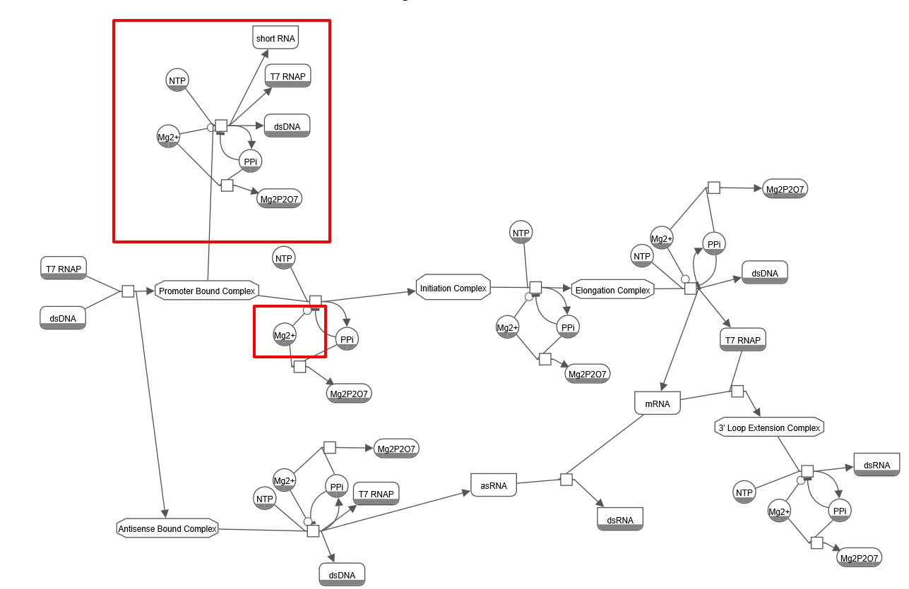

# T7 RNAP IVT Model

> **Mechanistic Modeling of In Vitro Transcription: A Quality by Design Approach to Predict mRNA Yield and dsRNA Impurities**

*Jean-Philippe Seiler — FH Aachen University of Applied Sciences — March 2026*

---

## Table of Contents

- [Background](#background)
- [Problem Statement](#problem-statement)
- [Model Overview](#model-overview)
- [Reaction Network](#reaction-network)
- [Key Parameters](#key-parameters)
- [dsRNA Formation Mechanisms](#dsrna-formation-mechanisms)
- [Model Validation](#model-validation)
- [Key Results](#key-results)
- [Future Extensions](#future-extensions)
- [Repository Structure](#repository-structure)
- [Software](#software)
- [References](#references)

---

## Background

Therapeutic mRNA and COVID-19 vaccines are produced through **T7 RNA polymerase (T7 RNAP) in vitro transcription (IVT)** — a well-established but industrially challenging process. The main cost drivers are:

- The **T7 RNA polymerase** enzyme
- The **DNA template (dsDNA)**

Optimizing yield while minimizing impurities at industrial scale remains a major challenge.

---

## Problem Statement

During IVT, unwanted by-products are formed, most critically **double-stranded RNA (dsRNA)**:

- dsRNA is **highly immunogenic** and triggers innate immune responses
- It must be removed via complex and expensive purification steps (e.g., HPLC)
- Two mechanisms generate dsRNA:
  - **3′-loopback extension**: the completed mRNA folds back on its own 3′ end, which T7 RNAP then extends using the mRNA itself as template
  - **Antisense (DNA-templated) transcription**: T7 RNAP binds to the non-template strand and produces complementary antisense RNA

> **Research question:** How can mechanistic modelling of T7 RNA polymerase transcription identify the kinetic and physicochemical parameters that most strongly determine dsRNA formation, in order to guide industrial process optimization and reduce purification costs?

---

## Model Overview

The model is implemented in **COPASI** as a system of ordinary differential equations (ODEs) and encodes three coupled pathways:

| Pathway | Description | Source |
|---|---|---|
| **Main pathway** | mRNA production via promoter binding, initiation, elongation & termination | Stover et al. (2025) |
| **DNA-templated dsRNA** | Antisense transcription from non-template strand | Arnold et al. (2001) |
| **RNA-templated dsRNA** | 3′-loopback extension of completed mRNA | Gholamilipour et al. (2018) |

### Species

| Species | Role |
|---|---|
| `dsDNA` | Template for mRNA synthesis |
| `T7 RNAP` | Enzyme catalyzing transcription |
| `NTPs` | Substrate consumed during RNA synthesis |
| `Mg2+` | Cofactor required for NTP–T7 RNAP interaction |
| `PPi` | Pyrophosphate released after each NTP incorporation |
| `mRNA` | Target product |
| `asRNA` | Antisense RNA intermediate |
| `dsRNA` | Immunogenic by-product |
| `MgPPi (Mg₂P₂O₇)` | Mg²⁺ chelation product, inhibitory precipitate |

---

## Reaction Network

The full model contains **14 reactions**:

| # | Name | Reaction | Rate Law |
|---|---|---|---|
| 1 | T7 Binding to dsDNA | T7 RNAP + dsDNA ⇌ Promoter Bound Complex | Mass action (reversible) |
| 2 | Mg2+ + PPi = MgPPi2 | Mg2+ + PPi ⇌ MgPPi2 | Mass action (reversible) |
| 3 | Elongation & Termination | 1990·NTPMg + Initiation Complex → mRNA + T7 RNAP + PPi + Mg2+ | MM with competitive inhibition |
| 4 | Initiation Step | 10·NTPMg + Promoter Bound Complex → Initiation Complex + PPi + Mg2+ | MM with competitive inhibition |
| 5 | NTP + Mg2+ = NTPMg | NTP + Mg2+ ⇌ NTPMg | Mass action (reversible) |
| 6 | PPiase Reaction | PPi → 2 Pi | Henri-Michaelis-Menten (irreversible) |
| 7 | Mg precipitation | 3 Mg2+ + 2 Pi → Mg₃(PO₄)₂ solid | Mass action (irreversible) |
| 8 | T7 RNAP half-life | T7 RNAP → T7RNAP_inactivated | Mass action (irreversible) |
| 9 | Antisense Binding | T7 RNAP + dsDNA ⇌ Antisense Bound Complex | Mass action (reversible) |
| 10 | AS Elongation | 1990·NTPMg + AS Initiation Complex → asRNA + T7 RNAP + PPi + Mg2+ | MM with competitive inhibition |
| 11 | as + mRNA = dsRNA | asRNA + mRNA → dsRNA | Mass action (irreversible) |
| 12 | Initia ASRNA | 10·NTPMg + Antisense Bound Complex → AS Initiation Complex | MM with competitive inhibition |
| 13 | 3′ Loop Binding | T7 RNAP + mRNA ⇌ 3′LoopExtensionCplx | Mass action (reversible) |
| 14 | 3′ Loop Extension | 3′LoopExtensionCplx + 10·NTPMg → dsRNA + T7 RNAP + PPi + Mg2+ | MM with competitive inhibition |

### SBML Reaction Network

The full SBML network diagram shows all species and reaction connections across the three pathways:



*Full SBML network: main mRNA pathway (center), antisense DNA-templated pathway (bottom-left), and 3′-loopback RNA-templated pathway (bottom-right).*

### Simplifications

Two reactions from the full literature model were **deliberately excluded**:
- The **short-RNA pathway** has negligible impact on dsRNA formation and consumes only a negligible fraction of the NTP pool
- **Mg²⁺-dependent T7 RNAP stabilization** was omitted because industrial IVT reactions maintain Mg²⁺ concentrations far above NTP levels

---

## Key Parameters

### T7 RNAP Promoter Binding (Reaction 1)
| Parameter | Value | Unit | Source |
|---|---|---|---|
| k_on | 204,000 | l/(µmol·h) | Stover et al. (2025) |
| K_D | 50 | nM | Stover et al. (2025) |
| k_off = k_on · K_D | 10,200 | h⁻¹ | Stover et al. (2025) |

### Initiation (Reaction 4)
| Parameter | Value | Unit | Source |
|---|---|---|---|
| k_init | 1,220 | h⁻¹ | Stover et al. (2025) — Fluc template |
| K_m | 50 | µmol/l | Arnold et al. (2001) |
| K_i (PPi) | 200,000 | µmol/l | Arnold et al. (2001) |

> The Fluc transcript length was chosen as the closest available analogue to clinical mRNA IVT products.

### Elongation (Reaction 3)
| Parameter | Value | Unit | Source |
|---|---|---|---|
| k_e,tot | 136 | h⁻¹ | Stover et al. (2025) — Fluc template |
| K_m | 50 | µmol/l | Arnold et al. (2001) |
| K_i (PPi) | 200 | µmol/l | — |

### Mg²⁺ / PPi Equilibrium (Reaction 2)
| Parameter | Value | Unit | Source |
|---|---|---|---|
| K_d (MgPPi) | 17 | µM | Arnold et al. (2001) |
| k_1 | 1,000 | l/(µmol·h) | — |
| k_2 | 17,000 | h⁻¹ | — |

### 3′ Loop Binding (Reaction 13)
| Parameter | Value | Unit | Source |
|---|---|---|---|
| k_1 (association) | 204,000 | l/(µmol·h) | Gholamilipour et al. (2018) |
| k_2 (dissociation) | 10,200,000 | h⁻¹ | Arnold et al. (2001) |

> The 3′ loop complex dissociates ~10⁴× faster than a true promoter complex.

### 3′ Loop Extension (Reaction 14)
| Parameter | Value | Unit | Rationale |
|---|---|---|---|
| k_cat | 50 | h⁻¹ | ~3× slower than normal elongation; reflects distributive, pause-prone RNA-templated synthesis |

### Antisense Binding (Reaction 9)
| Parameter | Value | Unit | Source |
|---|---|---|---|
| k_on | 204,000 | l/(µmol·h) | Stover et al. (2025) |
| K_D (antisense) | 500,000 | nM | ~10⁴× weaker than promoter; Gunderson et al. (1987) |
| k_off | 102,000,000 | h⁻¹ | — |

### Sense-Antisense Hybridization (Reaction 11)
| Parameter | Value | Unit | Source |
|---|---|---|---|
| k_hyb | 6 | l/(µmol·h) | Stover et al. (2025) |

> Hybridization is treated as irreversible: over the IVT timescale, the RNA duplex does not dissociate.

---

## dsRNA Formation Mechanisms

### 1. 3′-Loopback Extension (dominant pathway)
After full-length mRNA is released, T7 RNAP can rebind the free 3′ end and extend it using the mRNA itself as template. This produces a short antisense tail covalently linked to the mRNA, creating a dsRNA hairpin structure.

- Extension is **distributive**: the polymerase extends a few bases, releases, and rebinds
- dsRNA formed is a short additional "tail", not a full-length antisense strand
- The process is **mass-action driven**: as mRNA accumulates, rebinding probability increases

### 2. DNA-Templated Antisense Transcription
T7 RNAP binds to the non-template (coding) strand of dsDNA in a promoter-independent manner and transcribes an antisense strand complementary to the mRNA. The antisense RNA then hybridizes with mRNA to form dsRNA.

- Non-promoter binding affinity is ~10⁴-fold lower than promoter binding
- The dsRNA fraction from this pathway remains **constant with respect to reaction conversion**
- The 3′-loopback fraction **rises linearly with conversion** (key distinguishing feature)

---

## Model Validation

### mRNA Yield

The COPASI model was validated against experimental data from **Akama et al. (2012)**:

| Condition | Experimental | Model |
|---|---|---|
| 1.5 µM dsDNA, 1990 bp | ~1.05 g/L | ✅ Reproduced |
| 3.0 µM dsDNA, 856 bp | ~0.9 g/L | ✅ Reproduced |

The model correctly reproduces the **characteristic sigmoidal production profile** (slow initiation → rapid elongation → saturation).


*Left: COPASI model output showing the sigmoidal mRNA production profile (1.5 µM dsDNA, 1990 bp → 1.05 g/L). Right: experimental data from Akama et al. (2012) across varying T7 RNAP concentrations (0.05–0.8 µM).*

### dsRNA Ratio

Under high-yield IVT conditions (Stover et al., 2025), the model predicts a dsRNA ratio in the range of **≈0.3–0.5%**, matching experimental values for wild-type T7 RNAP — correct order of magnitude confirmed.


*Left: COPASI-predicted dsRNA ratio over time (~0.05% at 2.5 h). Right: experimental dsRNA percentage (w/w) from Stover et al. (2025) for WT T7 RNAP (filled circles) and the G47A+884G mutant (filled squares) across RNA transcripts of 850–2900 nt.*

---

## Key Results

### 1. Effect of T7 RNAP Concentration on dsRNA Ratio

Higher T7 RNAP concentration increases the dsRNA ratio in a clear dose-dependent manner, as faster RNA synthesis amplifies both productive and off-pathway reactions.


*Conditions: dsDNA = 0.0092 µM, NTP = 20,000 µM, Mg2+ = 21,000 µM, T7 RNAP = [0.096–0.384] µM. Left: dsRNA ratio time profiles. Right: final dsRNA ratio vs. T7 RNAP concentration.*

---

### 2. Effect of dsDNA Concentration on dsRNA Ratio

More dsDNA provides more correct promoter binding sites for T7 RNAP, so the polymerase binds less frequently to mRNA, reducing off-pathway dsRNA formation.


*Conditions: dsDNA = [0.0046–0.0184] µM, NTP = 20,000 µM, Mg2+ = 21,000 µM, T7 RNAP = 0.192 µM. Left: dsRNA ratio time profiles. Right: final dsRNA ratio vs. dsDNA concentration.*

---

### 3. T7 RNAP / dsDNA Ratio is the Dominant Control Parameter

The higher the T7 RNAP/dsDNA ratio, the higher the dsRNA ratio, because excess polymerase has fewer promoter sites available and therefore binds more frequently to mRNA.


*Conditions: dsDNA = [0.0046–0.0184] µM, NTP = 20,000 µM, Mg2+ = 21,000 µM, T7 RNAP = [0.096–0.384] µM. Left: dsRNA ratio time profiles for all combinations. Right: final dsRNA ratio vs. T7/dsDNA ratio.*

---

### 4. Effect of NTP Concentration on dsRNA Ratio

Higher NTP concentration increases the dsRNA ratio because more mRNA accumulates in solution, increasing off-pathway hybridization and 3′-loopback events.


*Conditions: dsDNA = 0.0092 µM, NTP = [10,000–40,000] µM, Mg2+ always in excess, T7 RNAP = 0.192 µM. Left: dsRNA ratio time profiles. Right: final dsRNA ratio vs. NTP concentration.*

---

### 5. Optimal Operating Point — mRNA Yield at dsRNA Threshold

mRNA yield increases strongly with dsDNA concentration, confirming that promoter availability is the main limiting factor. High T7 RNAP alone does not improve yield when dsDNA is limiting.


*mRNA yield (µM) at dsRNA ratio ≤ 0.01 threshold or 2-hour time limit, across a grid of T7 RNAP (0.096–0.384 µM) and dsDNA (0.008–0.05 µM) concentrations. The highlighted optimum (0.036 µM dsDNA + 0.096 µM T7 RNAP) delivers ~9.92 µM mRNA with 28% less dsDNA than the reference condition.*

---

## Future Extensions

1. **Free Mg²⁺ cofactor mechanics** — explicit Mg²⁺ dependency in elongation rate to model reactions where Mg:NTP < 1
2. **Dynamic pH modeling** — RNA synthesis releases H⁺, causing pH drift during high-yield reactions
3. **Fed-batch simulation** — transition from static batch to dynamic fed-batch with continuous NTP feeding; slow NTP addition keeps concentrations at 1–2 mM, preventing PPi accumulation and reducing 3′-loopback dsRNA formation

---

## Repository Structure

```
T7-RNAP-IVT-Model/
│
├── README.md
│
├── model/
│   └── T7_IVT_model.cps                               ← COPASI model file
│
├── figures/
│   ├── SBML.png                                        ← Full SBML reaction network
│   ├── mRNA yield validation.png                       ← mRNA yield vs. Akama 2012
│   ├── dsRNA ratio validation.png                      ← dsRNA ratio vs. Stover 2025
│   ├── Effect of T7 RNAP concentration on dsRNA ratio....png
│   ├── Effect of dsDNA concentration on dsRNA ratio.png
│   ├── T7 RNAP-dsDNA ratio vs dsRNA ratio.png
│   ├── Effect of NTP concentration on dsRNA ratio.png
│   └── mRNA yield heatmap at dsRNA threshold          ← Yield optimization heatmap
│
└── references/
    └── references.txt
```

> **Note on filenames:** GitHub is case-sensitive. Make sure your filenames match exactly as listed above, including spaces.

---

## Software

| Tool | Purpose |
|---|---|
| [COPASI](http://copasi.org/) | ODE model building, simulation, and parameter scanning |
| SBML (Systems Biology Markup Language) | Model exchange format |

---

## References

- **Arnold, T.E. et al. (2001)** — Kinetic model of T7 RNAP; first quantitative description of PPi competitive inhibition and non-promoter binding constants.
- **Akama, K. et al. (2012)** — Thermodynamic control of IVT; Mg₂P₂O₇ precipitation as mechanism of reaction shutdown.
- **Gholamilipour, Y. et al. (2018)** — Experimental demonstration of the 3′-loopback mechanism; T7 RNAP rebinds mRNA 3′ end for distributive primer extension.
- **Stover, C. et al. (2025)** — Mechanistic modeling of initiation/elongation competition and dsRNA generation via 3′-loopback under mass-action kinetics.
- **Gunderson, S.I. et al. (1987)** — Binding constants of T7 RNAP for promoter vs. non-promoter DNA sites (~10⁴-fold difference).

---

## Citation

If you use this model or find it helpful, please cite:

```
Seiler, J.-P. (2026). Mechanistic Modeling of In Vitro Transcription:
A Quality by Design Approach to Predict mRNA Yield and dsRNA Impurities.
FH Aachen University of Applied Sciences.
```

---

*© 2026 Jean-Philippe Seiler — FH Aachen University of Applied Sciences*
